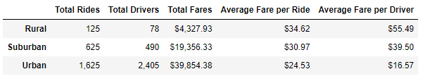
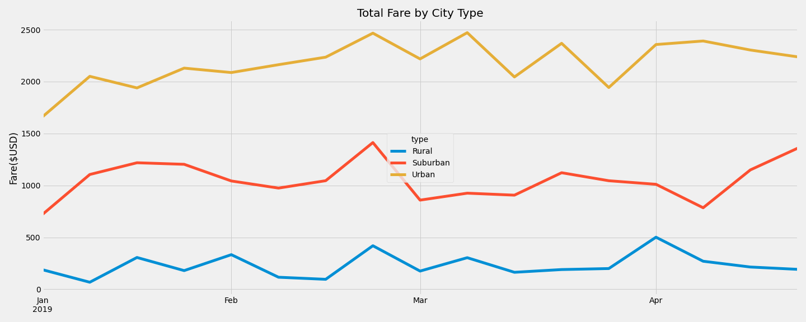
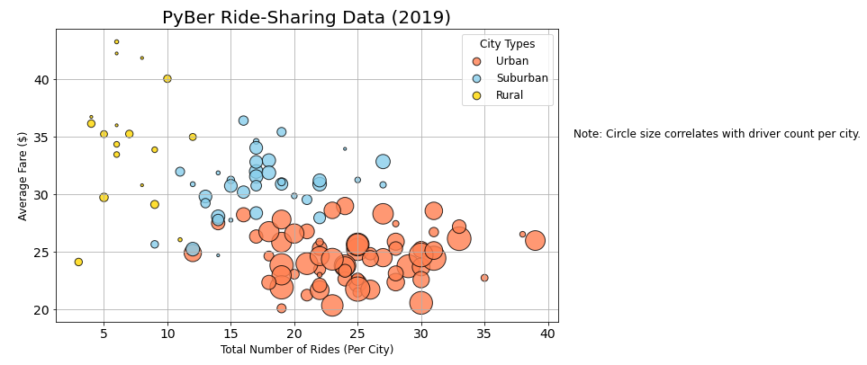
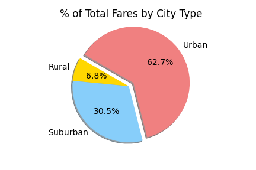
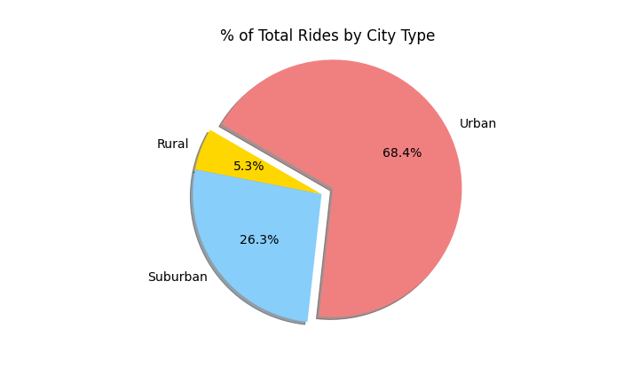
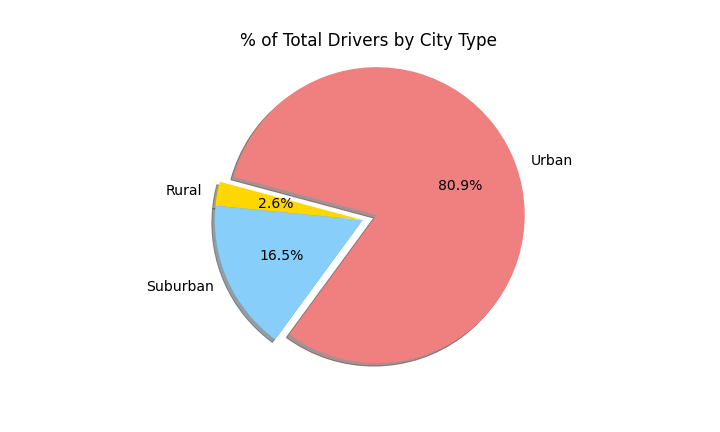

# **PyBer Analysis**

## **Overview**

The purpose of the new analysis is to show how the ride-sharing data differs by city type and how those differences can be used by decision-makers at PyBer.

## **Results**

Please see the table below for the PyBer ride-sharing data summary:

## **Summary**
