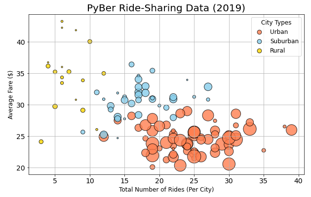
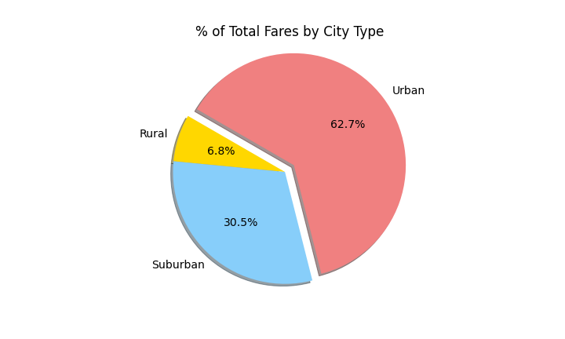

# **PyBer Analysis**

## **Overview**

The purpose of the new analysis is to show how the ride-sharing data differs by city type and how those differences can be used by decision-makers at PyBer.

## **Results**

Please see the table below for the PyBer ride-sharing data summary:

#### Bubble Chart: PyBer Ride-Sharing Data (2019)

The bubble chart below shows the relationships for each city type between the:
- Total Number of Rides (per City)
- Driver Count per City
- Average Fare($)

*Note: circle size correlates with driver count per city.*

Some observations from the chart are:
- Rural cities seem to have the lowest total number of rides, lowest driver counts per city, and highest average fares.
- Suburban cities seem to have more total number of rides, higher driver counts per city, and lower average fares than Rural cities.
- Urban cities seem to have the highest total number of rides, highest driver counts per city, and lowest average fares.
- Cities of all types with fewer total rides and lower driver counts per city tend to have higher average fares than cities with higher total rides and higher driver counts per city.

#### Box-and-Whisker-Plots: Measures of Central Tendency & Spread by City Type

The following box-and-whisker plots display the measures of central tendency and spread by city type for:
- Number of Rides
- Number of Drivers
- Fare($USD)

These plots quantify and support the observations from the bubble chart.

#### Pie Charts: % by City Type

The pie charts below display the % by City Type for:
- Total Rides
- Total Drivers
- Total Fares

The pie charts clearly show the Urban city type has the most rides, drivers, and fares. 

Though the Suburban and Rural drivers combined are less than 20% of total drivers, the combined rides for these city types are about 30% of total rides, and combined fares are about 40% of total fares. 

#### Line Chart: Total Fare by City Type (per Week) for January-April 2019 

Lastly, the line chart below shows the Total Fare by City Type per week between January-April 2019.

Between January-April 2019 Urban city type had the highest fare, Suburban the next highest fare, and Rural the lowest fare. The Rural and Suburban city types seem to be underserved markets for PyBer compared to the Urban city type.

## **Summary**

To address the disparities among the city types, I recommend the following to PyBer's CEO:
1. Increase the driver counts for Rural and Suburban type cities. This could be done by increasing advertising for drivers and/or offering bonuses to new drivers.
2. Increase the number of rides for Rural and Suburban type cities. This could be done by increasing advertising for riders and/or offering price promotions to riders.
3. Decrease average fares for Rural and Suburban type cities. This could be done by measuring sprawl (distance from city center) in Rural and Suburban type cities and adjusting fares accordingly.
